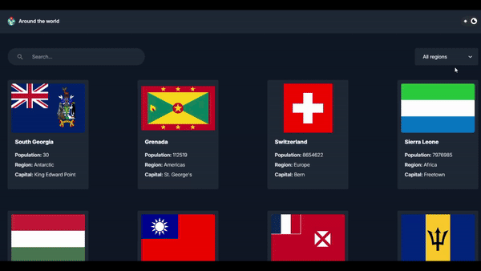

# 🌐 Around the World

## 📝 Description

**Around the World** is an interactive web project aimed at providing comprehensive information about travel destinations around the globe. The project was developed using HTML, CSS, JavaScript, React, Tailwind CSS, and Vite, focusing on modern and interactive user interface design. It was created as part of my final project in a web development course.

### Screenshot




## ✨ Features

- **HTML:** Structuring the website with semantic elements.
- **CSS:** Styling and layout using advanced features.
- **JavaScript:** Adding interactivity and dynamic functionality.
- **React:** Building a component-based user interface for improved performance and maintainability.
- **Tailwind CSS:** Utilizing utility-first CSS framework for rapid UI development and responsiveness.
- **Vite:** Using Vite as the build tool for fast development and optimized production builds.

## 🚀 Challenges and Solutions

Throughout the development of **Around the World**, I encountered several challenges that I successfully overcame:
- **🌐 Cross-browser Compatibility:** Ensuring consistent appearance and functionality across different browsers.
- **📱 Responsive Design:** Making sure the site adapts seamlessly to different screen sizes.
- **⚡ Performance Optimization:** Enhancing animations and interactivity to achieve a smooth user experience.

## 🛠️ Installation

To run the project locally, follow these steps:
1. Clone the repository:
    ```bash
    git clone https://github.com/MohamedRafatabotaleb/Around-the-world.git
    ```
2. Navigate to the project directory:
    ```bash
    cd Around-the-world
    ```
3. Install the dependencies:
    ```bash
    npm install
    ```
4. Start the development server:
    ```bash
    npm run dev
    ```
5. Open `index.html` in your preferred web browser.

## 🌍 Live Demo

You can view the live version of the project [here](https://around-the-world-amber.vercel.app/).

## 💡 Usage

Explore the features and test the interactivity of the website by resizing your browser window and interacting with the elements. The project demonstrates a modern approach to web design and development, suitable for various devices and screen sizes.

## 🤝 Contributing

Contributions are welcome and appreciated. To contribute:
1. Fork the repository.
2. Create a new feature branch:
    ```bash
    git checkout -b feature-branch
    ```
3. Make your changes and commit them:
    ```bash
    git commit -m 'Add new feature'
    ```
4. Push to the branch:
    ```bash
    git push origin feature-branch
    ```
5. Open a pull request.

## 📬 Contact

For any inquiries, feedback, or suggestions, please feel free to contact me:
- Email: mohamedrafat.abotaleb@gmail.com
- Phone: 01123640791
- LinkedIn: [mohamedraafatabotaleb](https://www.linkedin.com/in/mohamedraafatabotaleb/)

---

Developed by [Mohamed Rafat Mohamed](https://github.com/MohamedRafatabotaleb)
